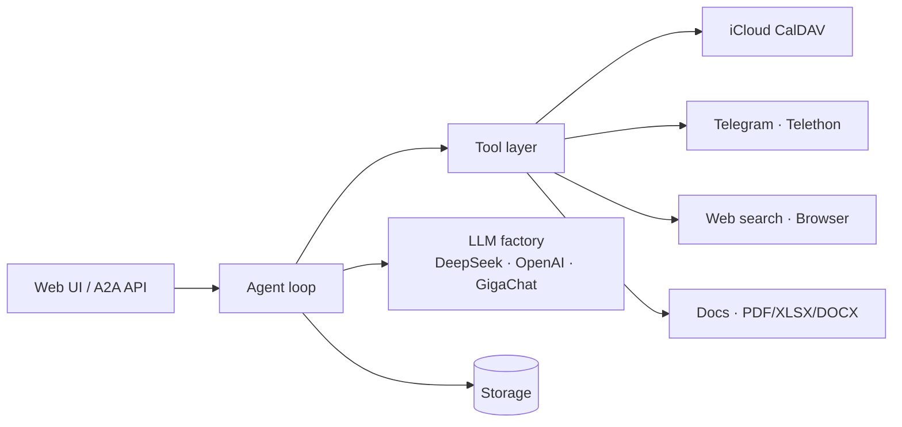

<div align="center">

# 🤖 AI Assistant

**A self-hosted personal AI agent that actually does things — your calendar, your Telegram, your files, any LLM.**

[](https://www.python.org/)
[](https://fastapi.tiangolo.com/)
[](https://github.com/BerriAI/litellm)
[](#-quick-start)
[](https://github.com/simeonkolchin/ai-assistant/actions/workflows/ci.yml)
[](LICENSE)


[Quick Start](#-quick-start) · [How It Works](#️-how-it-works) · [Features](#-key-features) · [Integrations](#-integrations) · [Configuration](#️-configuration)

</div>

---

## 🚀 What is AI Assistant?

**AI Assistant** is a single-user, self-hosted agent with a web UI. You chat with it, and it acts on *your* real services — reads and creates iCloud calendar events and reminders, reads/searches/sends Telegram messages in chats you allowlist, searches the web, drives a headless browser, and processes documents. Swap the underlying LLM (DeepSeek / OpenAI / GigaChat) on the fly from the UI selector without restarting.

> 💡 **Design principle — "empty key = disabled".** Every integration turns itself off if you don't provide its credentials. Run it with just one LLM key, or wire up everything.

## ⚡ Quick Start

**Docker Compose (recommended — bundles a SearXNG search backend):**

```bash
git clone https://github.com/simeonkolchin/ai-assistant.git
cd ai-assistant
cp .env.example .env      # add at least one LLM key
docker compose up --build
# → open http://localhost:8082
```

**Local (Python 3.11+):**

```bash
pip install -r requirements.txt
playwright install --with-deps chromium   # for the browser tool
cp .env.example .env
python main.py            # serves on http://localhost:8080
```

## 🏗️ How It Works



The agent receives a message, decides which tools to call, executes them through the tool layer, and returns the result. LLM calls go through a factory so the active provider is swappable at runtime — the provider is resolved automatically from the model id prefix (`deepseek/…`, `openai/…`, `gigachat/…`). An A2A (agent-to-agent) protocol layer lets it also be driven by other agents.

## ✨ Key Features

- 🔄 **Hot-swappable LLMs** — switch DeepSeek / OpenAI / GigaChat right from the UI selector
- 📅 **iCloud** — read & create calendar events and reminders over CalDAV
- 💬 **Telegram** — read, search and send messages in allowlisted chats (Telethon)
- 🌐 **Web search** — DuckDuckGo + self-hosted SearXNG
- 🖥️ **Browser automation** — Playwright-driven headless browsing
- 📄 **Document processing** — PDF / XLSX / DOCX pipelines
- 🔐 **Auth** — OIDC / JWT-protected web UI, Telegram chat allowlisting
- 🧩 **Optional integrations** — GitLab, YouGile, Outline wiki (enable via env)

## 🔌 Integrations

| Integration | Purpose | Enable with |
|---|---|---|
| iCloud (CalDAV) | Calendar & reminders | `ICLOUD_USERNAME`, `ICLOUD_APP_PASSWORD` |
| Telegram (Telethon) | Read / search / send | `TELEGRAM_API_ID`, `TELEGRAM_API_HASH`, `TELEGRAM_PHONE` |
| Web search | DuckDuckGo / SearXNG | on by default |
| Browser | Playwright automation | on by default |
| GitLab | Issues / MRs | `GITLAB_TOKEN`, `GITLAB_URL` |
| YouGile / Outline | Tasks / wiki | `YOUGILE_API_KEY` / `OUTLINE_API_TOKEN` |

## 🤖 Supported LLMs

Anything LiteLLM speaks, wired here for **DeepSeek**, **OpenAI** and **GigaChat**. Add a provider by dropping its key in `.env` — the LLM factory picks it up, and the model selector in the UI switches between them without a restart.

## ⚙️ Configuration

All configuration is via `.env` (see [`.env.example`](.env.example)). Empty value = integration disabled.

| Variable | Description |
|---|---|
| `LLM_PROVIDER` | Default provider (`deepseek` / `openai` / `gigachat`) |
| `DEEPSEEK_API_KEY` | DeepSeek key |
| `OPENAI_API_KEY` | OpenAI key |
| `GIGACHAT_CREDENTIALS` | GigaChat authorization key (Base64 `client_id:secret`) |
| `TELEGRAM_API_ID` / `TELEGRAM_API_HASH` / `TELEGRAM_PHONE` | Telegram credentials from my.telegram.org |
| `TELEGRAM_ALLOWED_CHATS` | Comma-separated allowlist of chats (empty = all) |
| `ICLOUD_USERNAME` / `ICLOUD_APP_PASSWORD` | Apple ID + app-specific password |
| `OIDC_ISSUER_URL` | OIDC issuer for the web UI (auth) |

## 🛡️ Security

- OIDC / JWT-protected web UI
- Telegram actions restricted to an **allowlist** of chats
- Secrets live only in `.env` (gitignored); `.env.example` ships placeholders only
- Telegram session files are gitignored and never committed

See [SECURITY.md](SECURITY.md) for how to report a vulnerability.

## 📚 Documentation

- [Getting Started](docs/getting-started.md)
- [Architecture](docs/architecture.md)
- [Configuration reference](.env.example)

## 🗺️ Roadmap

- [ ] Voice input/output
- [ ] Pluggable memory / long-term context
- [ ] More first-class integrations
- [ ] English + Russian UI

## 🧑‍💻 Contributing

Contributions welcome — see [CONTRIBUTING.md](CONTRIBUTING.md).

## 📄 License

MIT © [Simeon Kolchin](https://github.com/simeonkolchin)

> 🌱 This project grew out of [**vilena**](https://github.com/simeonkolchin/vilena) — an earlier attempt at a personal AI assistant.
</content>
