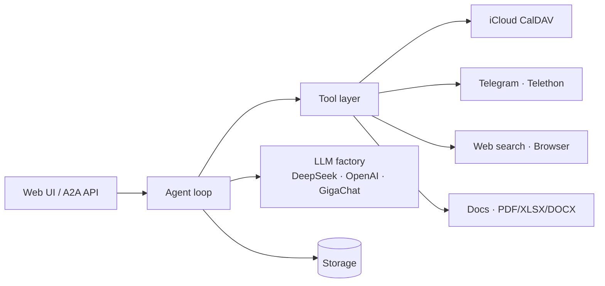

# Architecture

AI Assistant is a single-user FastAPI application that wraps an agent loop
around a swappable LLM and a set of real-world tools.

## High-level flow

## Components

| Area | Location | Responsibility |
|---|---|---|
| Entry point | `main.py` | CLI that boots the uvicorn server |
| App / lifecycle | `src/app.py` | FastAPI app, startup/shutdown, middleware |
| Configuration | `src/config.py` | Pydantic settings loaded from `.env` |
| Agent | `src/agent/team_agent.py` | The reasoning loop and tool dispatch |
| LLM factory | `src/llm/` | Resolves provider from model id prefix |
| Tools | `src/tools/` | iCloud, Telegram, web search, browser, GitLab, YouGile, Outline, files |
| Auth | `src/auth/` | OIDC / JWT middleware and routes |
| A2A protocol | `src/a2a_integration/` | Agent-to-agent driving surface |
| Documents | `src/docs/` | PDF / XLSX / DOCX processing pipeline |
| Storage | `src/storage/` | Chat history and integration tokens |
| UI | `src/ui/` | Web UI routes and Telegram admin |

## LLM factory

Model selection is by id prefix. The UI selector sends a model id like
`deepseek/deepseek-v4-pro`, `openai/gpt-4o`, or `gigachat/GigaChat-2-Max`; the
factory (`src/llm/`) picks the matching provider, key, and base URL at request
time. Because everything routes through [LiteLLM](https://github.com/BerriAI/litellm),
providers are swappable mid-conversation without a restart.

## Tool layer

Each tool reads its own credentials from `settings` and disables itself when
they are missing ("empty key = disabled"). The agent exposes tools to the LLM,
executes the calls the model requests, and feeds results back into the loop
until it produces a final answer.

## Search backend

Web search uses DuckDuckGo out of the box and a self-hosted SearXNG instance
(started by `docker-compose.yml`) reachable at `SEARXNG_URL`.
